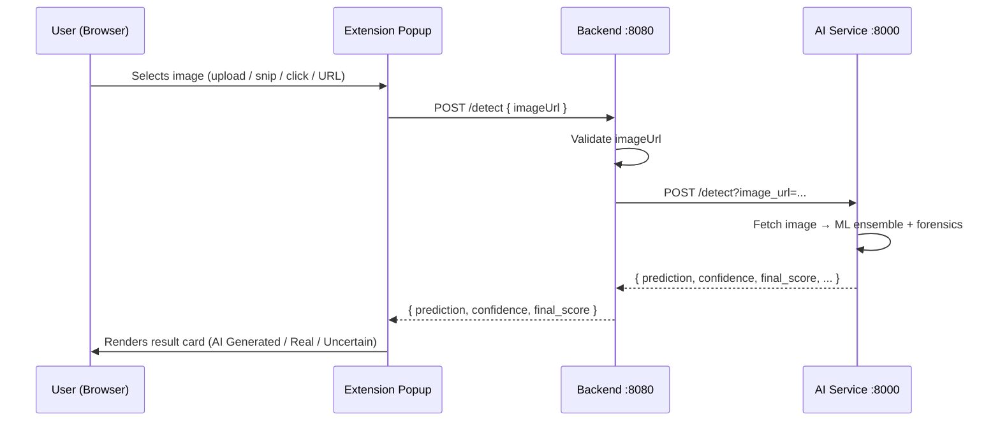

# 🛡️ Vision Guard

> **A Chrome browser extension that detects AI-generated and deepfake images in real time.**


---

## What is Vision Guard?

Vision Guard is a **Chrome Manifest V3 browser extension** that lets you pick any image — from a file, a screen crop, a page click, or a pasted URL — and instantly run it through a multi-model ML pipeline to determine whether it is **AI-generated or real**.

The extension sits in the browser toolbar. The heavy-lifting ML analysis runs locally on your machine via a FastAPI Python service, with a Spring Boot backend acting as a validation gateway between them.

---

## How it Works

```
┌─────────────────────────────────────────────────────┐
│              Chrome Extension (Popup UI)             │
│         React 19 + Vite 7 + TailwindCSS 4           │
│                                                      │
│  ┌──────────────┐  ┌────────────┐  ┌─────────────┐  │
│  │ Upload Image │  │ Snip Screen│  │ Click Image │  │
│  └──────────────┘  └────────────┘  └─────────────┘  │
│           └──────────────┴──────────────┘            │
│                    POST /detect                      │
│                  { imageUrl: "..." }                 │
└─────────────────────────┬───────────────────────────┘
                          │ HTTP :8080
┌─────────────────────────▼───────────────────────────┐
│              Spring Boot Backend                     │
│           Java 17 · Spring Boot 4 · Maven            │
│  • Validates imageUrl (must be http/https/data:image)│
│  • Forwards request to AI service                    │
└─────────────────────────┬───────────────────────────┘
                          │ HTTP :8000
┌─────────────────────────▼───────────────────────────┐
│              FastAPI AI Service                      │
│     Python 3.13 · FastAPI · HuggingFace · PyTorch    │
│  • 4 HuggingFace vision models (majority vote)       │
│  • Frequency forensics (FFT high-frequency analysis) │
│  • Metadata forensics (EXIF / AI software tags)      │
│  • Pixel forensics (ELA + color kurtosis)            │
│  ──────────────────────────────────────────────────  │
│  Returns: { prediction, confidence, final_score }    │
└─────────────────────────────────────────────────────┘
```

### Communication Flow



---

## Input Methods

| Method | How it Works |
|---|---|
| **Upload Image** | `FileReader` reads a local file as a data URL for preview |
| **Snip Screen** | `chrome.tabs.captureVisibleTab` grabs a screenshot; user draws a crop box |
| **Click Image** | Content script injected into the page; user left-clicks an image; URL captured via `chrome.storage.local` |
| **Paste URL** | User types, pastes, or drags an HTTP(S) image URL directly |

> Only **URL-based images** are sent to the backend. File/snip analysis triggers a "coming soon" message.

---

## Tech Stack

| Layer | Technology |
|---|---|
| **Extension UI** | React 19, Vite 7, TailwindCSS 4, Chrome Extension Manifest V3 |
| **Backend Gateway** | Java 17, Spring Boot 4, Lombok, Maven |
| **AI Service** | Python 3.13, FastAPI, HuggingFace Transformers, PyTorch, Pillow, NumPy, httpx |

---

## Project Structure

```
MEGAHACK-2026_SMOOTH_OPERATORS/
├── frontend/          # Chrome Extension (React + Vite)  → README inside
├── backend/           # Spring Boot proxy/gateway        → README inside
└── ai-service/        # FastAPI deepfake detection engine → README inside
```

---

## Quick Start

> Run all three services locally. Each has its own README with full details.

### 1 — AI Service (Python)

```bash
cd ai-service
python -m venv .venv
.venv\Scripts\activate        # Windows
# source .venv/bin/activate   # macOS / Linux

pip install -r Requirements.txt
uvicorn main:app --reload --port 8000
```

> ⚠️ First run downloads ~4 GB of HuggingFace model weights (cached after that).

### 2 — Backend (Java)

```bash
cd backend
./mvnw spring-boot:run
# Starts on :8080
```

Requires **Java 17+**. The Maven wrapper (`mvnw`) is bundled — no separate Maven install needed.

### 3 — Extension (Chrome)

```bash
cd frontend
npm install
npm run build
```

1. Open `chrome://extensions`
2. Enable **Developer mode**
3. Click **Load unpacked** → select `frontend/dist/`

---

## Detection Output

```json
{
  "prediction": "AI Generated",
  "confidence": "high",
  "final_score": 0.872
}
```

| prediction | Meaning |
|---|---|
| `AI Generated` | Image is likely synthetic |
| `Real` | Image appears authentic |
| `Uncertain` | Models disagree; treat with caution |

---

## License

MIT — see [LICENSE](LICENSE)
